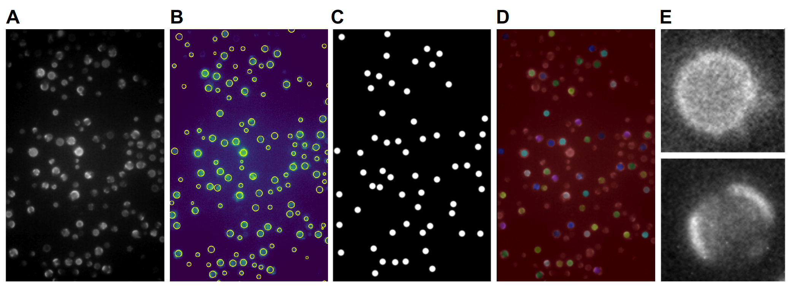

# demixing-yeast-vacuole

## Goal

1. The primary goal of this program is to manually count the number of vacuoles with and without domains in a given image.
2. The secondary goal for the user to be blind to the sample conditions of the image to minimize bias in the analysis. 

## Context

In order to get good statistics on a popluation of cells with phase separated vacuoles, thousands of vacuolues were analyzed. It was important to have an efficient and accurate way to analyze this data. Key features of this program include: 
- Automatic sifting through files to extract file information and open the images.
- Vacuoles are automatically identified in an image and individually presented to the user. This prevents double counting.
- Manual keybaord input and automatic advancement to the next image for quick tabulation.
- Information is automatically saved for future plotting.

To minimize bias, the user is blind to the sample temperature, growth temperature and field of view. 
- If the user knew the images was taken at a lower temperature they could guess that there should be more vacuoles with domains, and at high temperature that there should be less. In addition, depending on the growth temperature the user might guess that the transition temperature be lower or higher. This bias was avoided by automatically extracting the sample and growth temperatures from the file name and path. In addition, the program pulls images from a file in a random order. 
- Lastly, viewing an image with a large field of view may allow the user to deduce if the sample is at higher or lower temperature based on the relative presence of vacuoles with domains. This bias was avoided by individually cropping vacuoles out of the field of view and presenting them to the user one at a time. 

## Contents

Python scripts are located in the source folder under analysis. 

The first, vacuole_analysis.py, is the main program. The other three scripts (vacuole_assign.py, vacuole_discard.py, and vacuole_identifier.py) contain functions that the main script depends on. 

## How it works

